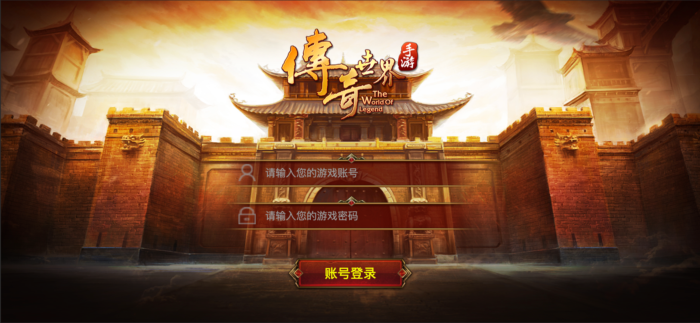
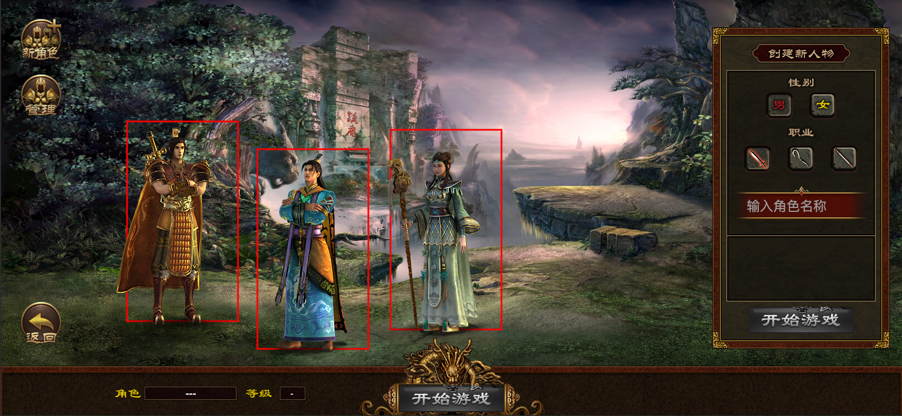
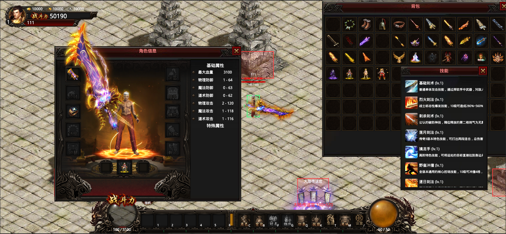
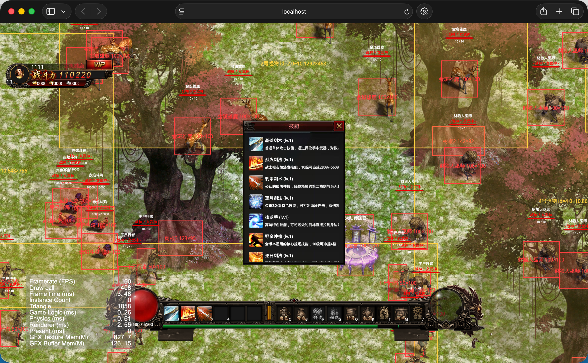
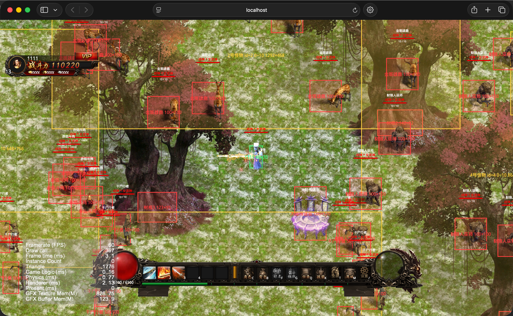
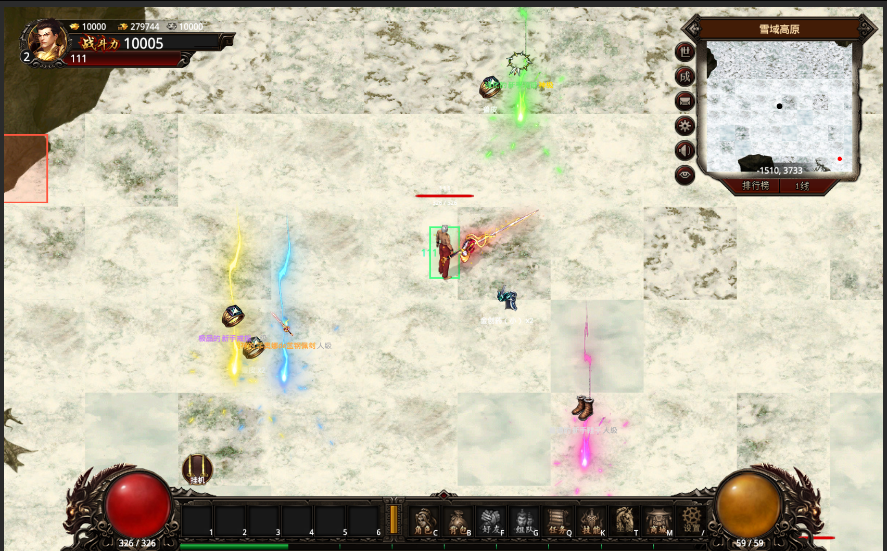
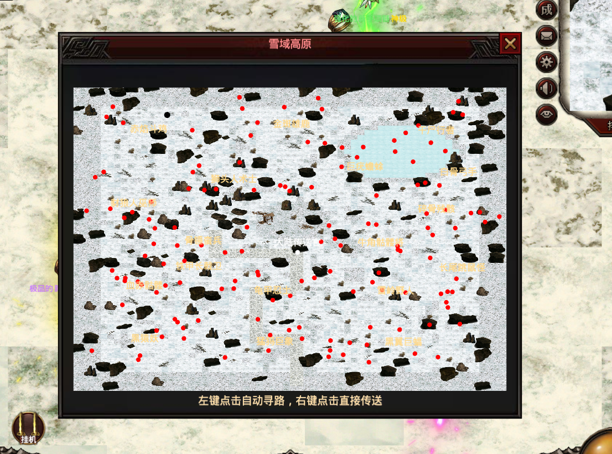
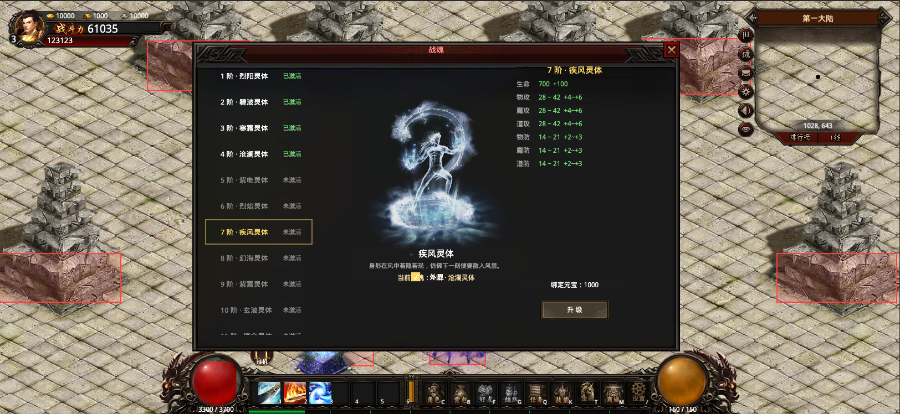
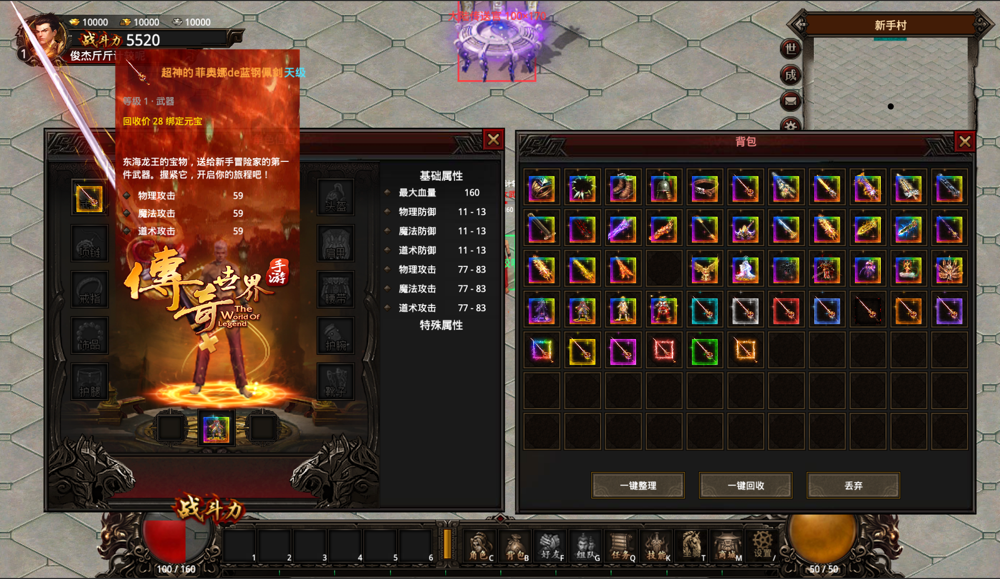
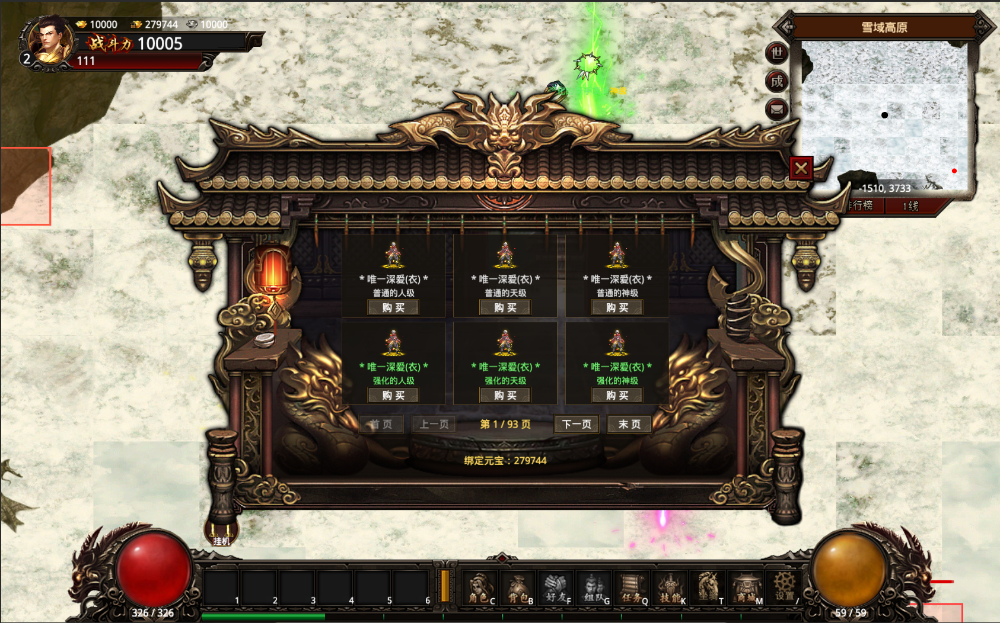

# olua

一个基于 Cocos Creator 3.8.7 的 2D 角色成长与装备玩法原型，聚焦登录、角色创建、角色成长、装备系统、地图探索与战斗玩法（打怪 / 掉落 / 技能 / 自动战斗）的交互演示。

## 项目简介

这个项目目前包含以下几部分：

- 登录场景、角色选择与创建场景
- 游戏场景主循环与地图切换（Loading 过渡场景，带进度显示）
- Tiled 地图渲染与对象组驱动：NPC 点位、复活点出生、矩形刷怪区、碰撞区
- 小地图（HUD）：底图用当前地图的 preview.jpg，按视野等比缩放并随角色平移，红点落在底图上的位置即怪物真实位置
- 路线指示线：自动寻路（点击寻路 / 快速攻击追怪 / 自动挂机）期间，大地图地面与右侧小地图同时画出「角色 → 目标」的白色点状路线，终点用更大的白圈标出目的地（同一处路径数据，终点随目标移动实时更新）
- 角色属性、等级与成长系统（HP / MP / 攻防区间 / 战斗力）
- 装备系统：穿脱、属性汇总、内外观（8 方向外观位置 / 缩放 / 旋转）、未穿衣服时**按性别显示默认身体**（男 role/1 / 女 role/2）、装备详情弹窗（三段式着色名称 / 等级 / 部位 / 属性区间）
- 装备前后缀变体：前缀（普通 / 强化 / 精良 / 极品 / 超神）× 后缀（人级 / 天级 / 神级）每件基础装备展开 15 个变体，属性按倍率逐项缩放，名称与文字按品质着色
- 装备品质边框与详情背景：背包格与身上装备图标按前后缀组合显示发光**边框动画**（resources/borders 84 张图集全登记），悬停详情弹窗按同一组合切换**背景动画**（resources/backgrounds 41 个帧序列目录全登记）；两者均取前 15 套按强度分配给 15 种组合，其余留给特殊装备的自定义表
- 战斗系统：技能触发统一入口、冷却（按动作速度折算）、魔法消耗、伤害飘字、击退、突进位移（十步一杀：鼠标落点瞬移 + 落点特效）
- 怪物系统：区域刷怪、AI 行为（待机游走 / 主动追击 / 受伤激怒追击 / 普攻）、死亡动画、信息面板、选中光圈
- 死亡与复活：怪物死亡倒地动画播完才消失；角色死亡停帧锁操控，弹窗选择原地复活 / 回复活点安全复活
- 经验与等级：击杀按角色与怪物等级差结算经验（差值越大越少，差 6 级以上无经验），升级属性重算并补满状态
- 掉落系统：按权重概率掉落、**掉落件数按每只怪配的区间随机**（如 `[1, 10]` = 本次掉 1~10 件，可重复命中同一物品）、掉落物同心环散落互不重叠、走上去自动拾取 / 点击拾取；**每只怪的掉落列表独立配置在 `configs/monsterDrops`（key 与怪物一一对应），条目逐条配权重 / 概率 / 数量**，555 件装备按等级分段铺满全部怪物
- 掉落光柱：装备落在地上时按前缀品质播放**光柱特效**（resources/effect/light 6 套全登记，前 5 套按普通→超神自动分配、第 6 套预留给特殊装备的自定义表）；地面掉落名按「前缀 + 名称 + 后缀」三段着色
- 商城系统：底部「商城」入口，**系统内全部装备（555 件含前后缀变体）自动上架**，默认 1 绑定元宝/件，购买直接进背包；门面式弹窗 + 卡片网格分页浏览（一行 3 张、每页 6 件），悬停图标看完整详情
- 背包操作：一键整理（合并同类可叠加物 + 按等级/部位重排，从第一格起铺满、空格沉底）、拖动物品换格（空格移动 / 同种合并 / 其余交换，拖物品不带动弹窗）、**拖出弹窗松手 = 整格销毁（全屏确认框：确定销毁 / 取消回原位）**、一键回收为绑定元宝、丢弃模式整格丢弃（不可恢复）；整理与移动规则均为纯函数、可单测
- 自动战斗：快速攻击与自动挂机开关，基于 A* 寻路绕障碍走位
- 状态（Buff）系统：技能附加状态、身上循环特效、头像下方图标条
- 悬停详情：鼠标放在状态图标上显示名称 / 介绍 / 剩余时间，放在技能格上显示技能名称 / 介绍 / 冷却等基础信息
- 战魂系统：37 阶成长线（外观取自 war-soul 素材），绑定元宝升级，属性计入战力与地图进入条件，可勾选外显到主角右上角；弹窗入口在角色信息弹窗「战魂」按钮（与「军衔」「称号」三格竖排相邻，NPC 战魂使者仍可用）
- 称号系统：34 个带字名牌动画（resources/titles 全登记）排成 1~34 阶成长线，解锁/升级流程与战魂一致（绑定元宝价格曲线），属性按曲线生成；解锁后名牌常显在角色头顶信息栏（与军衔红字/血条同一节点），弹窗入口在角色信息弹窗「称号」按钮（不走 NPC）
- 军衔系统：**100 阶**成长线（10 大段 × 10 阶：兵卒 → 校尉 → 都尉 → 中郎将 → 将军 → 重号将军 → 公卿 → 王爵 → 神将 → 神话），绑定元宝晋升，属性按「等效等级裸属性 × rate × 大段 factor」生成（夹在称号与战魂之间）；军衔**没有素材**，它的外观就是角色头顶信息栏血条上方那行**红字**，晋升后立即更新；弹窗入口在角色信息弹窗「军衔」按钮（三格最上），左栏 100 阶列表只在打开时建一次、切换选中不重建
- 头顶显示口径：**角色名称显示在人物区域正中间**（与怪物名称同一套「身体中心」口径，位置随 roleBody 高度自动居中）；头顶信息栏只留军衔红字 / 血条 / 血量文字，称号名牌动画插在最上方
- 弹窗层级：同屏打开多个弹窗时，**点哪个哪个浮到其它弹窗之上**（触摸与鼠标两条输入通道都接管；飘字提示、悬停物品详情这类临时层仍在弹窗之上，全屏确认框与死亡遮罩保持盖住弹窗）
- 地图传送：传送官弹窗按地图类型分类展示，等级/战力/战魂未达标的地图点击时提示
- 小地图弹窗：读取地图目录 preview.jpg 大图预览，左键点击自动寻路、右键点击直接传送
- 资源预加载：进图前预载地图、NPC / 怪物帧动画与角色穿戴外观
- 屏幕适配：铺满窗口（NO_BORDER）不留黑边，常驻 HUD 按可见区贴边重排；选角场景整块舞台等比缩放（contain），窗口宽高比与设计不一致时元素也不会跑到屏幕外

## 游戏截图

**登录**

**角色选择与创建**

**游戏主界面（角色信息 / 背包 / 技能弹窗）**

**技能列表**

**怪物与战斗**

**装备掉落光柱（地面掉落物按前缀品质播放光柱特效：普通→超神 5 档自动分配，第 6 套预留给特殊装备）**

**小地图预览弹窗（大图预览 + 怪物红点 / NPC / 刷怪区；左键点击自动寻路、右键直接传送）**

**战魂系统**

**装备品质边框与详情背景（背包 15 种前后缀品质边框；悬停详情弹窗显示按品质切换的背景动画）**

**商城（系统内全部装备上架，一行 3 张卡片、每页 6 件分页浏览；悬停图标看完整详情）**

## 目录结构

> 约定：**核心代码只做「怎么跑」，一切可调的东西都在 `assets/configs`**——
> 数值、文案、布局、配色、时长、资源路径都不写在逻辑里。
> 自查：`node tools/audit-config-leak.cjs`（扫出散落在 ui/ 里的可配置项与未登记的文案 key）。

- assets/configs：数值与静态配置（按域一文件：role/monster/skill/equipments/items/drop/map/status/border/background/title/light/mall 等）
  - configs/texts：**面向玩家的全部文案**（浮动提示 / 校验原因 / 界面标签 / 悬停详情 / 加载进度，带 `{占位符}` 模板）
  - configs/bottomNav：底部功能入口表（名称 / 图标 / 解锁等级 / 快捷键）
  - configs/layout：UI 布局与样式（hud / dialogs / panels / scenes / borders / backgrounds / lights / images / sizes / theme）
- assets/types：纯类型声明（common/role/animation/good/skill/map/monster/drop/status/border/background/title/light）
- assets/entities：运行时实体（Role）
- assets/skills：技能行为实现（技能实现只依赖 SkillContext，不反查全局）
- assets/ui：界面脚本
  - ui/core：静态管理器（GameHelper/LayerManager/MonsterManager/MonsterAI/DropManager/SkillManager/StatusManager/EffectManager/AutoBattle/PreloadManager/StorageManager/RoleUIManager/SceneManager 等）
  - ui/components：按职责分组（hud/panel/dialogs/role/input/map）
  - ui/helpers：UI 生成（UiHelper 基础封装 / GameUiHelper 零件库 / AnimationHelper 帧动画）
  - ui/utils：纯函数工具，按功能域分目录（battle/drop/map/physics/resource/input/cursor/node）
- assets/resources：资源目录（地图 tmx、帧动画、图集、图标、UI 素材）
- assets/scenes：登录、角色选择、加载和游戏场景
- tools：本地校验脚本（审计：配置外泄 / 点击穿透；单测：背包整理 / 背包拖动 / 背包回收 / 背包丢弃 / 装备边框 / 装备详情背景 / 掉落名 / 详情弹窗摆放 / 弹窗层级 / 称号 / 军衔 / 新手背包 / 商城 / 装备光柱 / 角色默认外观 / 角色帧素材 / 装备外观切片 / 文案 / 角色删除）+ 边框素材索引图 border-preview.png
- website：项目官网（纯静态单页：核心特色 / 截图画廊 / 联系方式，logo 与 favicon 在 website/assets/icons）
- public：截图、展示素材与联系方式二维码

## 技术栈

- Cocos Creator 3.8.7
- TypeScript
- Cocos UI / 2D 场景系统 / Box2D 物理（刚体与碰撞体）

## 运行方式

1. 安装并打开 Cocos Creator 3.8.7。
2. 通过 Creator 的 “Open” / “Open Project” 打开当前仓库目录。
3. 在编辑器中打开 assets/scenes 下的场景文件。
4. 使用预览或播放按钮运行项目。

注意：这个仓库本身不提供 npm start 或 build 脚本，项目依赖 Cocos Creator 编辑器来启动和预览。

## 预览与常见问题

预览报错排查、常见问题与踩坑记录（输入系统、掉落、背包整理/回收等）已单独成文：**[FAQ.md](FAQ.md)**。

## 功能清单

> ✅ 已完成　❌ 未完成

### 账号与角色

| 功能           | 说明                                |  状态 |
| ------------ | --------------------------------- | :-: |
| 登录 / 角色选择与创建 | 最多 3 个角色，在线角色本地存档                 |  ✅  |
| 旧存档自动迁移      | 新增字段/存储格式变更时读取自动补齐（装备/背包 id 引用制等） |  ✅  |
| 删除角色         | 选角界面「管理」进入管理态，各角色头顶出现删除按钮，两步确认后从存档移除 |  ✅  |
| 新角色出生背包     | 通用件 + 全部基础武器/衣服，外加 **1 级武器的全部前后缀变体（15 件品质）** 一起发进背包，出生即可对比外观与边框 |  ✅  |
| 泡点活动         | 持续获得经验，经验条与等级动态更新                 |  ✅  |

### 地图与场景

| 功能               | 说明                                                             |  状态 |
| ---------------- | -------------------------------------------------------------- | :-: |
| 场景切换与 Loading 过渡 | 换图/进图带进度显示                                                     |  ✅  |
| Tiled 对象组驱动      | NPC 点位、复活点、矩形刷怪区、碰撞区                                           |  ✅  |
| 复活点出生            | 进图/传送统一从 revive 点出生                                            |  ✅  |
| 小地图              | 真实地图底图（地图 preview.jpg 按视野等比缩放、随角色平移）+ 名称/世界坐标/角色黑点/附近怪物红点/寻路路线 |  ✅  |
| 小地图预览弹窗          | 读取地图目录 preview.jpg，左键点击自动寻路、右键点击传送；NPC 白点与名称、刷怪区名称、寻路路线        |  ✅  |
| 地图传送官弹窗          | 按 MapType 分类，标题 + grid 排列传送按钮，新增地图自动扩展                         |  ✅  |
| 地图进入限制           | 等级/战力/战魂未达标时拦截传送并提示原因                                          |  ✅  |
| 碰撞范围调试可视化        | 按开关显示碰撞框（角色/障碍/怪物配色区分）                                         |  ✅  |

### 角色成长

| 功能          | 说明                            |  状态 |
| ----------- | ----------------------------- | :-: |
| 等级属性成长      | 按等级生成攻击/防御区间，战斗力计算            |  ✅  |
| 击杀经验        | 按角色与怪物等级差衰减（差 ≥6 级无经验），击杀位置飘字 |  ✅  |
| 升级流程        | 属性重算、血蓝补满、升级特效                |  ✅  |
| HP / MP     | 血球魔法球、头顶血量实时刷新、魔法自然回复         |  ✅  |
| 战魂系统        | 37 阶单一成长线，左中右三栏弹窗，绑定元宝升级；入口 = 角色信息弹窗「战魂」按钮（紧邻「称号」），NPC 战魂使者仍可用 |  ✅  |
| 战魂属性生效      | 各阶属性计入角色属性与战斗力，并作为地图进入条件      |  ✅  |
| 战魂外显        | 弹窗勾选后当前等级战魂动画挂主角右上角，切图/重登保留   |  ✅  |
| 称号系统        | 34 个带字名牌动画（resources/titles 全登记）排成 1~34 阶成长线；解锁/升级流程与战魂一致（绑定元宝价格曲线），属性按「等效等级裸属性 × rate × 系列 factor」生成 |  ✅  |
| 称号外显        | 解锁后名牌**常显在角色头顶信息栏**（与名称/血条同一个节点，原生尺寸不缩放），无开关、切图/重登保留；入口在角色信息弹窗「称号」按钮（紧邻「战魂」，不走 NPC） |  ✅  |
| 军衔系统        | **100 阶**（10 大段 × 10 阶）单一成长线，左中右三栏弹窗 + 军衔徽记；绑定元宝晋升（价格 = 30 × N²），属性按「等效等级裸属性 × rate × 大段 factor」生成（满衔 ≈ 裸属性 52.5%，夹在称号 39% 与战魂 67% 之间） |  ✅  |
| 军衔外显        | 军衔名以**红色文字常显在角色头顶信息栏血条上方**（角色名称之下，军衔没有素材、这行红字就是它的外观），未授衔留空、晋升后立即更新，切图/重登保留；入口在角色信息弹窗「军衔」按钮（与「战魂」「称号」三格竖排相邻，不走 NPC） |  ✅  |
| 战魂数值与消耗逐级手调 | 升级消耗与属性为公式占位，待逐级调整            |  ❌  |

### 装备与物品

| 功能        | 说明                                                                               |  状态 |
| --------- | -------------------------------------------------------------------------------- | :-: |
| 装备穿脱与属性汇总 | 穿戴校验（等级/性别/职业），换装实时重算                                                            |  ✅  |
| id 引用制存储  | 装备槽/背包存物品 key，改配置重启即生效                                                           |  ✅  |
| 内外观显示     | 8 方向外观位置/缩放/旋转、内观位置、前后缀与标签                                                       |  ✅  |
| 装备/物品配置   | 12 衣服、20 武器及戒指/项链/鞋/盔/带，带图标与文案                                                   |  ✅  |
| 装备前后缀变体   | 前缀 5 档 × 后缀 3 档，每件展开 15 变体（共 555 件），属性按倍率缩放、名称品质着色                               |  ✅  |
| 装备品质边框    | 背包与身上装备图标按前后缀组合显示发光边框**动画**（resources/borders 84 张图集全登记，前 15 张按强度分配给 15 组合），特殊装备可配自定义边框 |  ✅  |
| 装备详情弹窗    | 三段式着色名称、等级/部位、**回收价**、属性区间与基础信息；悬停位置由纯函数摆放（**尽量靠屏幕中间 + 整块留在可见区**，任意窗口尺寸/任意格子都完整可见）                          |  ✅  |
| 装备详情背景    | 详情弹窗按前后缀组合显示品质背景**动画**（resources/backgrounds 41 个帧序列目录全登记，前 15 个按强度分配给 15 组合），特殊装备可配自定义背景 |  ✅  |
| 掉落系统      | 权重掉落表、件数区间随机（`[1,10]` 掉 1~10 件）、同心环散落不重叠、自动拾取/点击拾取                               |  ✅  |
| 每怪独立掉落表   | `configs/monsterDrops` 一只怪一份列表，条目逐条配权重/概率/数量 + 掉落件数区间；药品材料按等级分档、装备按等级段铺满 555 件变体 |  ✅  |
| 背包一键整理    | 弹窗底部一键：合并同类可叠加物 + 按等级/部位重排，**从第一格起铺满、空格沉底**，算法纯函数可单测                                  |  ✅  |
| 背包拖动物品    | 按住物品拖到别的格子：空格 = 移动、同种可叠加 = 合并（超上限留原格）、其余 = 交换；幽灵图标跟随 + 落点高亮，拖物品**不会带动整个弹窗**，规则纯函数可单测                        |  ✅  |
| 背包一键回收    | 弹窗底部一键：背包里的装备换成**绑定元宝**（身上穿着的不算），价 = 等级曲线 × 前后缀倍率，两步确认后生效                          |  ✅  |
| 背包丢弃物品    | **把物品拖到背包弹窗外面松手** → 全屏确认框（确定 = 整格销毁、取消 = 物品回原位）；另有弹窗底部「丢弃」进入丢弃模式点格子丢弃（两步确认）。不限物品大类，与「一键回收」并存 |  ✅  |
| 通用确认框     | `components/dialogs/ConfirmDialog`：全屏模态黑幕 + 面板 + 确定/取消，自己独占触摸与鼠标两路输入（下层 UI 与世界都点不到）；文案由使用方从 `configs/texts` 传入 |  ✅  |
| 装备数值填写    | 战斗数值逐件调整                                                                         |  ❌  |
| 背包叠加数量角标  | 格子显示可叠加物品数量                                                                      |  ❌  |
| 掉落物名称前后缀  | 地面掉落名按「前缀 + 名称 + 后缀」拼全并**三段着色**（前缀/名称用前缀色、后缀用后缀色），与装备详情弹窗**同走一套取色规则**；非装备仍单行白字 |  ✅  |
| 装备掉落光柱    | 装备落在地上时图标下方播放品质**光柱动画**（resources/effect/light 6 套全登记，前 5 套按前缀普通→超神自动分配、第 6 套预留给特殊装备自定义表），进图预载 |  ✅  |
| 商城系统       | 底部「商城」入口（M）：**系统内全部装备**（555 件含前后缀变体）自动上架，默认 1 绑定元宝/件，购买直接进背包（余额不足/背包满不扣钱不改包）；弹窗即商城门面背景（resources/mall/bg），商品**一行 3 张卡片、每页 6 件分页浏览**（翻页整页重建，打开不卡顿），悬停图标看完整详情；商品与价格见 `configs/mall` |  ✅  |

### 战斗与技能

| 功能         | 说明                                     |  状态 |
| ---------- | -------------------------------------- | :-: |
| 技能系统       | 统一触发入口、冷却/耗蓝/距离校验、特效、击退                |  ✅  |
| 键盘 + 鼠标双操控 | WASD/SHIFT + 左键走右键跑、拖动实时改向、左键点怪攻击/右键选中 |  ✅  |
| 自动战斗       | 快速攻击/挂机开关，A* 寻路绕障碍，卡住换目标               |  ✅  |
| 路线指示线      | 自动寻路期间大地图地面 + 小地图同步绘制白色点状路线（终点大白圈）     |  ✅  |
| 状态 Buff    | 技能附加状态、身上循环特效、图标倒计时                    |  ✅  |
| 突进技能（十步一杀） | 按鼠标位置瞬移：范围内落鼠标点、范围外按技能距离取最远落点，落地播放特效   |  ✅  |
| 状态数值接入伤害   | 格挡/减伤/加防等数值效果参与结算                      |  ❌  |
| 怪物技能       | 怪物释放配置的技能（当前只会普攻）                      |  ❌  |
| 玩家受击反馈     | 受击动作/飘字等表现完善                           |  ❌  |

### 怪物

| 功能          | 说明                       |  状态 |
| ----------- | ------------------------ | :-: |
| 区域刷怪        | 开图按地图配置的刷怪矩形随机生成         |  ✅  |
| 怪物 AI       | 待机游走、主动追击、被动怪受伤激怒追击、普攻结算 |  ✅  |
| 死亡动画        | 死亡倒地播完才移除节点，缺帧兜底直接移除     |  ✅  |
| 怪物地图信息      | 名称居中（主动红/被动黄），头顶血条+血量文字  |  ✅  |
| 怪物信息面板/选中光圈 | 点击选中，血量/属性实时显示           |  ✅  |
| 怪物定时刷新      | 死亡后按周期补充（当前开图生成一次）       |  ❌  |

### 死亡与复活

| 功能     | 说明                              |  状态 |
| ------ | ------------------------------- | :-: |
| 角色死亡流程 | 死亡动画停末帧、锁全部操控、怪物停止追击尸体          |  ✅  |
| 复活弹窗   | 黑色半透明遮罩 + 原地复活 / 安全复活（回当前地图复活点） |  ✅  |

### 界面与其他

| 功能              | 说明                                                                                                                          |  状态 |
| --------------- | --------------------------------------------------------------------------------------------------------------------------- | :-: |
| HUD 全家桶         | 角色信息栏/血球/魔法球/经验条/快捷键栏（6 格+冷却）/小地图                                                                                           |  ✅  |
| 悬停详情弹窗          | 状态图标悬停显名称/介绍/剩余时间；技能格悬停显名称/介绍/冷却等                                                                                           |  ✅  |
| 自定义鼠标指针         | 指向怪物攻击指针、指向物品按大类变色                                                                                                          |  ✅  |
| 资源预加载           | 进图前预载地图/NPC/怪物/外观帧动画，按目录缓存                                                                                                  |  ✅  |
| UI 命中检测         | 点击界面元素不穿透到世界（不打断操作）                                                                                                         |  ✅  |
| UI 点击不穿透（UI 内部） | 点击元素在鼠标事件通道上同时登记，点弹窗关闭按钮/面板不会触发下层 HUD（如误开小地图弹窗）                                                                             |  ✅  |
| 世界侧按压归属         | 按住走路以按下开始、抬起结束：界面拦下抬起时交还世界侧（不会卡住一直走）；按压起点由各界面元素自己登记（记的是引擎给的命中目标，与冒泡顺序无关），登记点一律先过 UITransform 防呆（不会把引擎打崩）；点 NPC 不误触发走路、不打断挂机 |  ✅  |
| 屏幕适配            | 铺满窗口（NO_BORDER）+ 常驻 HUD 贴边重排；选角场景整块舞台等比缩放，任意窗口宽高比下元素都在可见区内                                                                  |  ✅  |
| 素材缺口补齐          | 武器每方向后 4 帧、cloth 011/012/013、weapon 005/021 缺失资源                                                                            |  ❌  |
| 界面布局打磨与命名规范     | 整体视觉与资源命名统一                                                                                                                 |  ❌  |

## 素材与联系方式

> 资源素材过大无法进行版本控制，如果需要请联系我。

